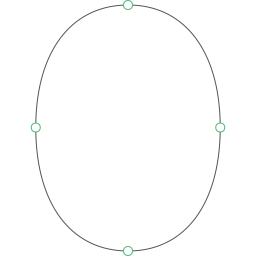

# Typollipse (beta)

Typollipse is a free and open-source plugin for [Glyphs.app](https://glyphsapp.com/) that automatically generates ‘ideal’ base curves. Simply select a curve segment and hit the *Apply* button.

The tool can be used to study and evaluate curvature, and to keep curvature consistent across a font or an entire font family.

Typollipse (short for Typographical Superellipse) uses a ratio-based algorithm that takes a curve segment as input and minimizes its curvature. The result is a curve that looks as ‘round’ as possible. This is the purely geometrical part. In practice, things are a bit more complicated — keep reading about anisotropy below.

## Anisotropy

Human perception is far from being *isotropic* (uniform) in all orientations, it is *anisotropic*. We typically perceive vertical structures enlarged as compared to horizontal ones. In type design, we account for this effect e.g. with contrast.

But our anisotropic perception does not only affect stroke widths, it also applies to curvature. This is why the plugin allows you to enter a value for anisotropy to counterbalance this effect. The value specifies how strong the anisotropy is (how much larger vertical structures are perceived).

Example: you want to design a zero-contrast font that actually has a vertical stem width of 100px and a horizontal stem width of 90px. Which implicitly means that you assume a 100px horizontal stem would be perceived as a 111px, so you make it 90px to visually look like 100px. How strong is the anisotropy? (100 – 90) / 90 = 0.11111… Here you would enter 11% (or more precise 11.111%) in the plugin’s *Anisotropy* field.

Unless you don’t want curvature and contrast to be in sync for stylistic reasons. If you are striving for a more ‘boxy’ design, simply increase the *Anisotropy* value. Vice versa you may want to create a high contrast font but do not want to counterbalance the curvature that much, then simply keep the value at around 10%.

## Installation
Download this Repository as ZIP file, unzip it, double click on `Typollipse.glyphsPalette` and let Glyphs copy the Plugin to its Plugin Folder.

## How to use
The plugin adds a new palette to the right sidebar. Enter a value for *Anisotropy*, select one or more curve segments, and hit the *Apply* button. The *Anisotropy* value is stored in the project file, hence each project has its own setting.

## Limitations
* Not all curves are independent, e.g. an outer path may be defined by the counter. In this case the counter can be created with the plugin and the curvature of the outer path has to be based on the counter (using the *Offset Curve* filter, an auxiliary construction, visual adjustment, etc.).
* Some curves need smoothing to ensure continuity (e.g. where the shoulder of the letter **n** connects with the right vertical stem), in this case the generated curve can only act as a base curve which has to be reworked afterwards.
* Some curves are defined by an adjacent curve with lower curvature, in this case harmonize (G2 continuity) the two curves by adjusting the curvature of the one with the higher curvature. 
* The plugin does not work for partial and slanted curves (italics), but there are plans to implement slanted curves as well.

## Get in touch
Questions? Requests? Bugs? Missing the plugin for another font editor? Open a GitHub issue or drop me a line: [mail@flachware.com](mailto:mail@flachware.com)