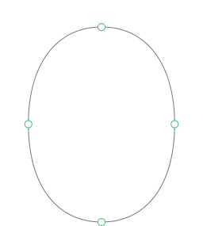

# Typollipse

Typollipse is a free and open-source plugin for [Glyphs.app](https://glyphsapp.com/) that generates ‘ideal’ base curves as a starting point. Simply select a curve segment and hit the *Apply* button.

Typollipse (short for Typographical Superellipse) uses an algorithm that takes a curve segment as input and minimizes its curvature peak. The result is a curve that looks as ‘round’ as possible. This is the purely geometrical part. In practice, things are a bit more complicated — keep reading about anisotropy below.

## Anisotropy

Human perception is far from being *isotropic* (uniform) in all orientations, it is *anisotropic*. We typically perceive vertical structures enlarged as compared to horizontal ones. In type design, we account for this effect e.g. with contrast.

Our anisotropic perception does not only affect stroke widths, it also applies to curvature. This is why the plugin allows you to enter a value for anisotropy to counterbalance this effect. The value specifies how strong the anisotropy is (how much larger vertical structures are perceived).

Example: you want to design a zero-contrast font that actually has a vertical stem width of 100px and a horizontal stem width of 90px. How strong is the anisotropy? (100 – 90) / 90 = 0.11111… Here you would enter 11% (or more precise 11.111%) in the plugin’s *Anisotropy* field.

Unless you don’t want curvature and contrast to be in sync for stylistic reasons. If you are striving for a more ‘boxy’ design, simply increase the *Anisotropy* value. Vice versa you may want to create a high contrast font but do not want to counterbalance the curvature that much, then simply keep the value at around 10%.

## Installation
The plugin is installed through Glyphs’ built-in *Plugin Manager*.

## How to use
The plugin adds a new palette to the right sidebar. Enter a value for *Anisotropy*, select one or more curve segments, and hit the *Apply* button. The *Anisotropy* value is stored in the project file, hence each project has its own setting.

## Limitations
The plugin does not work for slanted or partial curves by design.